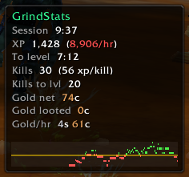

# GrindStats

A lightweight session tracker for **WoW Ascension** (WotLK 3.3.5). Shows XP/hour, gold/hour, kills, looted gold, and estimated time-to-level while you grind.



The XP/hr number tints red or green when your current pace drifts below or
above your session average, and the line graph at the bottom shows the same
thing over the last ~14 minutes (gold line = session average).

## Features

- Session timer with pause/resume
- XP gained and XP per hour (color-coded green/red vs session average)
- XP-rate sparkline graph (~14 minutes of history, toggle with `/gs graph`)
- Estimated time to next level, with rested XP % when applicable
- Kill count, XP per kill (last 10 kills, with outlier detection), and kills to level
- Net gold change and looted gold (from mobs/chests)
- Gold per hour
- Draggable window — position is saved per character
- Adjustable opacity — right-click the window

## Installation

1. Download or clone this repo.
2. Find your `Interface\AddOns` folder:
   - **Project Ascension (default install):**
     `C:\Ascension\Launcher\resources\ascension-live\Interface\AddOns\`
   - **Any other WotLK 3.3.5 client:** `<your WoW folder>\Interface\AddOns\`
     — the WoW folder is the one containing `Wow.exe`. If `AddOns` doesn't
     exist yet, create it.
3. Copy the `GrindStats` folder in, so the layout is exactly:
   ```
   Interface\AddOns\GrindStats\GrindStats.toc
   Interface\AddOns\GrindStats\GrindStats.lua
   ```
   The folder name must match the `.toc` name (`GrindStats`) — if you end up
   with a nested folder like `GrindStats-main\GrindStats\`, move the inner
   one. A mismatched or double-nested folder is silently ignored by the
   client.
4. **Fully restart the client** if it was running — a brand-new addon is only
   picked up at launch (`/reload` is enough for updates to an already-loaded
   addon).
5. At the character select screen, open **AddOns** (bottom-left button) and
   make sure **GrindStats** is checked. If it's greyed out as out of date,
   tick **Load out of date AddOns**.

### Settings & reset

Window position, opacity, and graph visibility are saved per character in:
```
WTF\Account\<ACCOUNT>\<Server>\<Character>\SavedVariables\GrindStats.lua
```
Delete that file (while logged out) to restore defaults. Session stats are
intentionally *not* saved — every login starts a fresh session.

### Troubleshooting

- **Window not visible?** `/gs show`, then `/gs` to confirm the addon loaded.
  If the slash command does nothing, the addon didn't load — recheck the
  folder layout and the AddOns list.
- **Dragged it off-screen?** It's clamped to the screen, but if it's lost,
  delete the SavedVariables file above.

## Slash commands

| Command | Description |
|---------|-------------|
| `/gs` | Show help |
| `/gs reset` | Restart the current session |
| `/gs pause` | Pause or resume the timer |
| `/gs show` | Show the tracker window |
| `/gs hide` | Hide the tracker window |
| `/gs graph` | Toggle the XP-rate sparkline |

Right-click the tracker window to open the opacity slider.

## Good to know

- **Kills to level** uses your last 10 kills and self-corrects: one odd XP
  value is ignored, but three kills in a row that disagree with the average
  by >25% reset the estimator (you changed camps or rested ran out). It also
  resets the moment you ding, so it's accurate again one kill later.
- **Rested XP is included** in per-kill numbers, so the estimate is right
  *now* but drifts up as the blue `rested %` burns down — kill XP roughly
  halves when it hits zero.
- Kills only count when they grant XP; gray mobs don't register.
- At level cap, "To level" and "Kills to lvl" show `--`.
- The whole session pauses with `/gs pause` — use it for AFKs and town trips
  so your averages stay honest.

## Compatibility

- **Interface:** 30300 (WotLK 3.3.5a)
- **Client:** Built on Project Ascension; nothing is Ascension-specific, any
  3.3.5 client works.
- **Language:** English clients only — kill and money tracking parse the
  English combat messages.
- No libraries, no dependencies, two files.

## License

MIT — use and modify freely.
